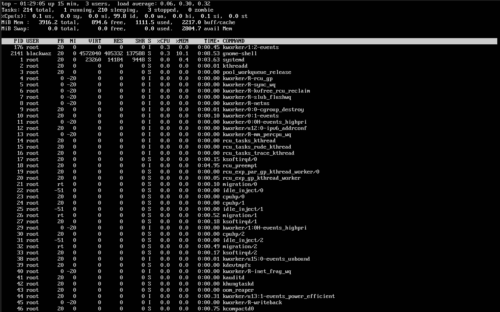
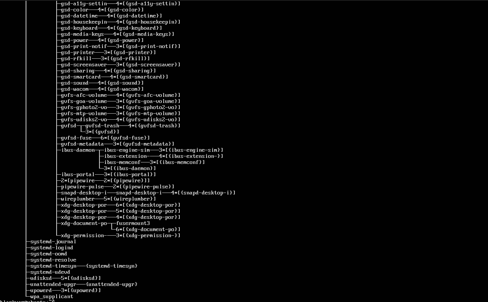
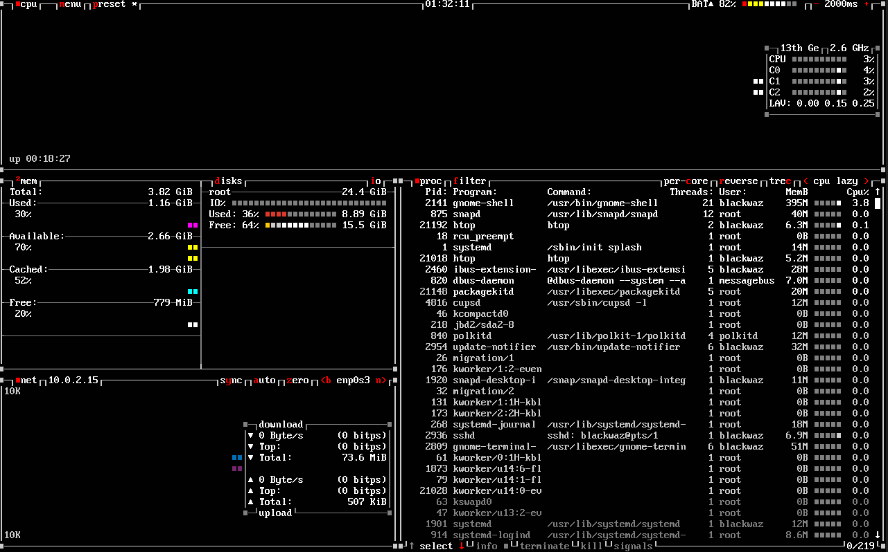

## Assessment Week 2: Security Planning and Testing Methodology

# 1. Performance Testing Plan
### **Objective:** The primary **objective** of this section is to establish a framework for monitoring system resource utilization and conducting stress tests on process management controls.

## Remote Monitoring Methodology

An **agentless monitoring approach** was adopted for this methodology. This involves using standard command-line interface (CLI) tools, accessed remotely via SSH, rather than installing resource-intensive graphical user interface (GUI) applications directly on the server.

## Tools Used
### `top`
A Linux interactive process viewer that provides a real-time display of system resource usage, including CPU, memory (RAM), running tasks, and system load.

### Usage Syntax

**`top`** Displays CPU, memory usage, and other system information.

**`P`** Inside `top`, pressing 'P' will sort and display processes by CPU usage.

**`M`** Similar to 'P', pressing 'M' will sort and display processes by memory usage.

*Note: More interactive alternatives to `top` include `htop` and `btop`.*

### `ps aux`
Used to capture a static snapshot of all currently running processes, along with comprehensive details about each process.

### Usages Syntax

**`ps aux`** Shows all processes.
**`ps aux --sort=-%mem`** Sorts processes by memory usage (descending order indicated by '-').
**`ps aux --sort=-%cpu`** Sorts processes by CPU usage.
**`ps -u username`** Shows processes belonging to a specific user.
**`ps -p <pid>`** Extracts a process by its process ID.
**`pstree -p`** Displays the process hierarchy in a tree view.

### `nmon`
An advanced system monitoring utility that includes a data export feature, making it suitable for subsequent data analysis.

### Usage Syntax

**`nmon [options]`**

### Options

**`-o <file>`** Specifies the output file for data logging.
**`-t`** Includes top processes in the view/report.
**`-a`** Captures all available statistics.
**`-D`** Displays Disk statistics.
**`-N`** Displays Network statistics.
**`-C`** Displays CPU statistics.
**`-M`** Displays Memory statistics.

## Testing Approach

A structured testing lifecycle was implemented to **validate the effectiveness** of the established process management controls.

## 1. Idle State

This section illustrates the baseline resource consumption of the server when it is under no active load.

### Idle state using `top`

### Idle state using `htop`

### Process Tree (`pstree`)

### `btop`

**Installation**
`sudo apt install btop`

**System idle state from Btop**

### `nmon`

**Installation**
`sudo apt install nmon`

**`nmon` menu page** (`nmon -a`)

**`nmon` view with CPU, Memory, and network status**

## Stress Testing Methodology

For the purpose of stress testing, the **`stress` tool** was selected. This utility is capable of generating system load, which can then be monitored using the tools detailed previously. The `stress` tool can be installed via the command `sudo apt install stress`. For more robust and powerful testing, the **`stress-ng`** utility is recommended.

## Tools for Load Generation

Several tools are available for Linux systems to generate artificial loads on components such as the CPU, GPU, RAM, and disk I/O. Most of these utilities can be installed using the command: `sudo apt install toolname`.

Some of the widely used tools include:

1.  **`stress`**: A fundamental and lightweight load generator designed to test the CPU, disk, and I/O speed. It is basic in nature and lacks the capability for detailed or heavy-duty testing.
2.  **`stress-ng`**: A highly configurable and powerful successor to `stress`. It can perform testing on over 200 components, including disk, virtual memory (VM), and file systems. It also has the ability to simulate kernel-level bugs.
3.  **`cpuburn`**: A tool that generates high thermal CPU stress, often used for stability testing under extreme thermal load conditions.
4.  **`lookbusy`**: Used to generate a realistic CPU load, configurable from 1% up to 100%.
5.  **`memtester`**: A utility for testing user-space allocated RAM, which is effective at detecting memory corruption issues.

### Using the `stress` tool

The command executed was: `stress --cpu 4 --timeout 60&`

### Results from Monitoring Tools

**`top`**

**`btop`**

**`nmon`**

**Process Tree (`pstree`)**

# Security Configuration Checklist and Testing Plan

## Initial SSH Setup

We will generate an SSH key pair on the workstation and use this key for remote SSH logins, bypassing the need for passwords. This action significantly reduces the risk of a successful brute-force login attempt against the system.

To generate the SSH key, the following command was used:

**`ssh-keygen -t ed25519 -C "server-key"`**

The **Ed25519** algorithm was chosen because it is based on elliptic-curve cryptography, offering robust security even with smaller key sizes (256-bit). Ed25519 keys are also notably faster to generate, sign, and verify, and they consume less CPU power.

Key features of this algorithm include:
1.  High level of security.
2.  Superior performance.
3.  Inherent safety against common implementation errors.
4.  Resistance to modern cryptographic attacks.

**Comparison: Ed25519 vs. RSA**

### Security
The security of **RSA** is directly dependent on the key size. A 2048-bit key is generally considered the minimum secure size, with 4096-bit keys offering greater assurance. However, RSA can be vulnerable if padding is implemented incorrectly, the key size is insufficient, or the random number generation is weak.

**Ed25519**, conversely, is built upon modern elliptic-curve cryptography (Curve25519). A 256-bit Ed25519 key provides security strength roughly equivalent to a 3072-4096 bit RSA key. Its design is highly resistant to common exploits such as timing attacks, cache attacks, and random number generator (RNG) failures, and it is less prone to implementation mistakes.

### Performance

**RSA** key generation, signing, and verification are comparatively slow, especially with larger key sizes. This can lead to increased CPU utilization and slower authentication on servers that manage numerous simultaneous SSH connections.

**Ed25519**, on the other hand, is exceptionally fast in key generation, signing, and verification. Its efficiency makes it an ideal choice for modern server environments, automation pipelines, and low-power devices like IoT hardware or Raspberry Pi systems. For any environment requiring frequent SSH connections, Ed25519 offers a significant performance advantage.

## SSH Hardening

SSH hardening involves modifying the SSH configuration file, typically located at `/etc/ssh/sshd_config`.

It is crucial to create a backup of the initial SSH configuration file before making any significant changes, allowing for a quick rollback in case of issues. The backup can be created using the command: `sudo cp /etc/ssh/sshd_config /etc/ssh/sshd_config.backup`

Before SSH configuration changes:

After SSH configuration changes:

**Changes Implemented**

1.  **`PasswordAuthentication no`**
    This change instructs the server to reject password-based logins over SSH. This setting is highly effective in securing the system against automated, password-based brute-force attacks.

2.  **`PubkeyAuthentication yes`**
    This setting ensures that login is possible using public/private key pairs. After generating the key on the workstation:

    

    The SSH public key was copied to the server, which enables passwordless login.

    

3.  **`PermitRootLogin no`**
    This configuration disables the ability to log in as the root user directly via SSH. This prevents unauthorized full system access and reduces the risk associated with a compromised root account.

4.  **`port 2424`** (Changing the default SSH port)
    Modifying the default SSH port is a common security practice used to deter automated scanning and attacks that target the standard port 22.

    

    The firewall must also be configured to permit traffic on the new port using the following commands:
    `sudo ufw allow 2424/tcp`
    `sudo ufw reload`

    

## Firewall Implementation (UFW)

**Setting up Default Policies**

**Commands:**
`sudo ufw default deny incoming`: Blocks all incoming network connection attempts by default.
`sudo ufw default allow outgoing`: Permits all outgoing traffic from the system (Egress).
`sudo ufw allow from 192.168.10.3 to any port 22`: Allows incoming connections from a specific IP address (the workstation) only to port 22 (the default SSH port, though this should be updated to 2424 if the port change is active).

## User and Privilege Management (UPM)

1.  **Creating a User**
    `sudo adduser adminuser`

    

2.  **Adding User to the `sudo` Group**

    

3.  **Verification of Group Membership**

    

4.  **Testing `sudo` Access**

    

5.  **Listing all Users with `sudo` Access**

    

## Access Control (MAC)

### AppArmor
AppArmor is a Linux security system that restricts the capabilities of individual programs. It functions as a Mandatory Access Control (MAC) system and is available on Ubuntu.

## Setting Up Automatic Updates

To ensure the automated installation of security updates, the **`unattended-upgrades`** package is utilized.

Command to install this package:
`sudo apt install unattended-upgrades`

**Enabling the Package**

The package can be enabled using the command: `sudo dpkg-reconfigure --priority=low unattended-upgrades`

The status of the `unattended-upgrades` service can be checked with the command: `sudo systemctl status unattended-upgrades`

## Threat Model

1.  **Brute Force SSH Attacks**
    Attackers commonly use automated scripts and dictionary attacks (e.g., using tools like John the Ripper with wordlists like rockyou.txt) to attempt to guess login credentials.
    *   **Mitigation**: By setting `PasswordAuthentication no` in the `sshd_config` file and enforcing public key login, the system is secured against password-based brute-force attacks.

2.  **Unrestricted Network Access (Reconnaissance)**
    Attackers may use bots and scanning tools like Nmap to identify open ports and exploit potential system vulnerabilities.
    *   **Mitigation**: The firewall (UFW) has been configured with a policy to deny all incoming traffic, with the exception of connections originating from the designated workstation. Implementing proper firewall rules significantly reduces the overall attack surface.

3.  **Root Privilege Compromise**
    An attacker who gains initial access may attempt to escalate privileges to the root account.
    *   **Mitigation**: Disabling direct root login via SSH (`PermitRootLogin no` in `sshd_config`) forces attackers to compromise a specific, non-root username first. Furthermore, creating a dedicated `adminuser` and granting `sudo` rights only when necessary adds an essential layer of protection and adheres to the principle of least privilege.

