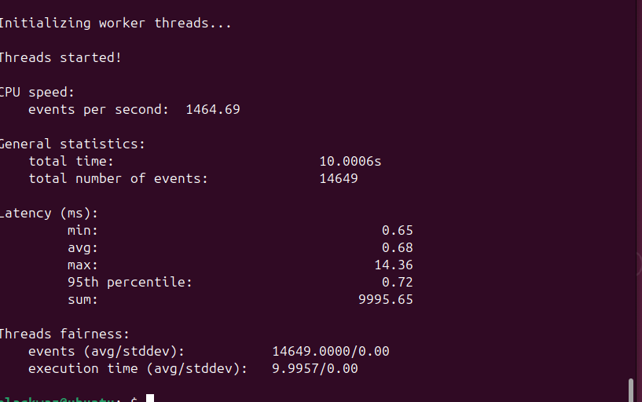
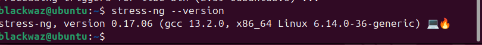
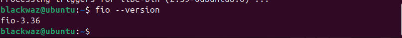
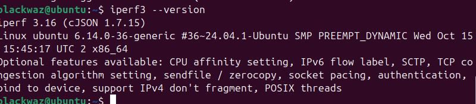

# Assessment Week 3: Performance Workload Generation and Tool Selection

## Introduction

This week's objective is to select and justify specific applications and tools for generating various types of system workloads for performance evaluation. For each selected tool, we will outline its key features and provide installation instructions.

## Application Selection 

### CPU-Intensive Workload

To generate CPU-intensive workloads, several tools are available, including `stress`, `stress-ng`, `sysbench`, `openssl`, and `prime95`/`mprime`. 

**Sysbench** was selected as the preferred tool because it generates a mathematically consistent processor load based on prime number calculations. This provides a stable and repeatable benchmark for CPU performance.

### Installation

This tool can be installed using `sudo apt install sysbench -y`.

Verification for installation can be done using `sysbench --version`.

### RAM-Intensive Workload

Tools for testing RAM performance include `stress`, `stress-ng`, and `memtester`. 

**Stress-ng** was chosen because it is an advanced version of the original `stress` tool. It allows for aggressive cycle memory allocation testing, which is effective for evaluating memory and swap performance.

### Installation

Installation can be done by using the command: 

`sudo apt install stress-ng -y`

Verification: `stress-ng --version`

### I/O-Intensive Workload

Alternatives for I/O testing include `stress`, `stress-ng`, `dd`, and `fio`. 

**Fio (Flexible I/O Tester)** was selected due to its high flexibility and configurability. It is capable of simulating specific I/O patterns, such as those found in database or file server environments, and can bypass the operating system's cache to measure the true speed of the underlying hardware.

### Installation

This tool can be installed using the command:

`sudo apt install fio -y`

Verification:

`fio --version`

### Network-Intensive Workload

**iPerf3** was chosen over other alternatives such as `ping`, `mtr`, `netperf`, `nload`, `ethtool`, `netcat`, `hping3`, `pingpong`, and `bmon`.

The justification for selecting iPerf3 is based on the following features:

1.  It generates pure TCP/UDP traffic between a client and server to accurately measure maximum throughput, jitter, and packet loss.
2.  It is completely independent of hard drive speed, focusing solely on network capacity.
3.  It is the optimal tool for testing network pipe capacity.

### Installation

It can be installed with:

`sudo apt install iperf3 -y`

Verification:

`iperf3 --version`

## Application Selection Matrix

The following matrix details the tools selected to generate specific workloads for performance evaluation, along with the justification for their selection over alternative options.

| Workload Type | Selected Application | Alternatives Considered | Justification for Selection |
| :--- | :--- | :--- | :--- |
| **CPU-Intensive** | **Sysbench** | stress, stress-ng, openssl, prime95 | Chosen for its mathematical consistency (prime number calculation), providing a stable, repeatable processor load ideal for benchmarking. |
| **RAM-Intensive** | **Stress-ng** | stress, memtester | Selected as an upgraded version of `stress`, allowing for aggressive cycle memory allocation testing and evaluation of swap performance. |
| **I/O-Intensive** | **Fio** | dd, stress, stress-ng | Preferred for its high flexibility and ability to simulate specific database/file server patterns and bypass the OS cache to measure true hardware speed. |
| **Network-Intensive** | **iPerf3** | ping, netcat, nload, hping3 | Best for testing pipe capacity, as it measures pure TCP/UDP throughput, jitter, and packet loss, independent of hard drive speeds. |

## Monitoring Strategy 

To measure the performance impact of the selected applications, we will utilize the monitoring tools and strategies established in Week 2.

## Expected Resource Profiles

Based on the selected applications, we anticipate the following resource usage patterns during the testing phase:

### 1. CPU Evaluation (Sysbench)

We anticipate a resource profile showing **100% utilization** of all assigned cores (User CPU time). The system Load Average is expected to rise to match the number of virtual CPUs (vCPUs). Memory and Disk usage will remain negligible during this specific test.

**Test Execution**
Command given: `sysbench cpu --cpu-max-prime=20000 run`

### 2. RAM Evaluation (Stress-ng)

We expect RAM usage to spike rapidly until the physical memory limit is reached. Once physical RAM is full, we anticipate a significant increase in **Disk I/O** as the operating system begins **swapping** (moving inactive memory pages to disk to prevent system instability). Processes like `kswapd` may be observed consuming CPU cycles during this phase.

**Test Execution**

Command given: `stress-ng --vm $(nproc) --vm-bytes 90% --timeout 20s`

### 3. Disk I/O Evaluation (Fio)

The Disk Read/Write speeds are expected to reach the physical or throttled limit of the drive. Consequently, CPU usage will likely manifest as high **"iowait"** time (the time the CPU spends idle, waiting for disk operations to complete) rather than active processing.

### 4. Network Evaluation (iPerf3)

CPU and RAM usage are expected to remain low. The primary metric will be network throughput, which is anticipated to plateau at the limit of the virtual **Network Interface Card (NIC)** or the bandwidth cap imposed by the hosting provider.

**Rules for Testing using iPerf3**

1.  iPerf3 must be installed on both the server and the client (Desktop).
2.  The server must be enabled for listening using the command: `iperf3 -s`.
3.  The client generates network traffic using the command: `iperf3 -c <serverip>`.
4.  The firewall (UFW) must be configured to allow the necessary network traffic, which can be done using: `sudo ufw allow <port>/tcp` (or `udp`).

## Monitoring Network Test using nmon

## Monitoring Strategy 

To measure the performance impact of the selected applications, we will utilize the monitoring tools and strategies established in Week 2.

