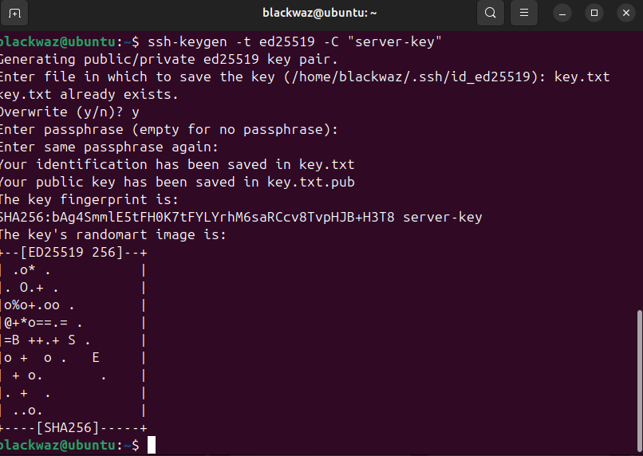
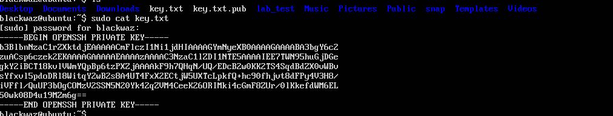

## Server Hardening

---

## 1. SSH Configuration Using Key‑Based Authentication

This section outlines the configuration of Secure Shell (SSH) key‑based authentication as a server hardening measure. Key‑based authentication enhances security by eliminating password‑based logins, thereby reducing exposure to brute‑force and credential‑based attacks.

### Step 1: SSH Key Pair Generation

The initial step involves generating an SSH key pair on the client workstation using the following command:

```bash
ssh-keygen -t ed25519 -C "comments"
```

This command generates a cryptographically secure private key, which remains on the workstation, and a corresponding public key that will be deployed to the remote server.



---

### Step 2: Deployment of the Public Key to the Server

After generating the key pair, the public key is securely transferred to the server using the command below:

```bash
ssh-copy-id username@server_ip_address
```

This process appends the public key to the `~/.ssh/authorized_keys` file on the server, enabling authentication via SSH keys.



---

### Step 3: SSH Daemon Configuration

To enforce exclusive use of key‑based authentication, the SSH daemon configuration file is modified as follows:

```bash
sudo nano /etc/ssh/sshd_config
```

The following configuration parameters are applied:

```text
PubkeyAuthentication yes
PasswordAuthentication no
```

These settings ensure that public key authentication is enabled while password‑based authentication is disabled, significantly improving access control.


Following these changes, the SSH service is restarted to apply the new configuration.

---

### Step 4: Verification of SSH Access

Once configuration is complete, secure access to the server can be established using the following command:

```bash
ssh username@ip_address
```

Successful login without a password confirms correct implementation of key‑based authentication.


---

## 2. Firewall Configuration to Restrict SSH Access

To further strengthen server security, the Uncomplicated Firewall (UFW) is configured to restrict SSH access to a single trusted workstation IP address.

### Firewall Status Prior to Configuration


### Applied Firewall Rules

```bash
ufw allow from workstation_ip_address to any port 22 proto tcp
ufw deny 22/tcp
```

These rules explicitly permit SSH connections only from the specified IP address while denying all other inbound SSH traffic.

### Firewall Status After Configuration


---

## 3. User Management and Non‑Root Administrative Account

To comply with best security practices, a non‑root administrative user is created to minimize risks associated with direct root access.

### Creation of Administrative User


### Verification of Sudo Privileges


### Functional Testing of Administrative Access


---

## Principle of Least Privilege

The principle of least privilege dictates that users should be granted only the minimum permissions required to perform their assigned tasks. Adhering to this principle reduces the likelihood of accidental misconfiguration and limits the potential impact of malicious activity.

---

## Rationale for Using a Non‑Root Administrative User

Unrestricted root access provides complete control over the operating system, which poses significant security risks if misused. Employing a non‑root administrative account with controlled sudo privileges enables necessary administrative functions while reducing the risk of unintended system‑wide changes.

---

## Remote Administration Demonstration

The following screenshots demonstrate secure remote administrative operations performed using the configured non‑root administrative account.

.png)

.png)

.png)

---

## SSH Connection Demonstration

The screenshots below illustrate successful SSH connections established using key‑based authentication.

.png)

.png)

.png)

.png)


