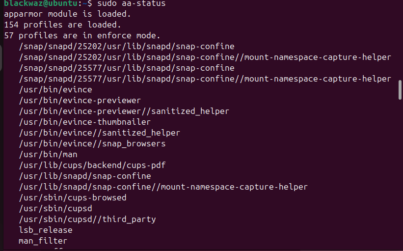
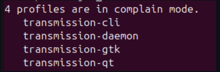
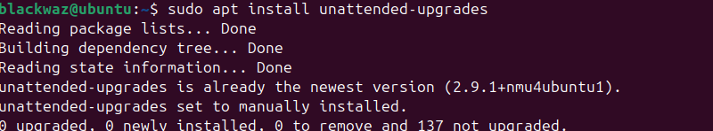
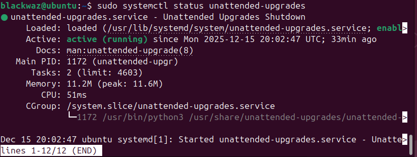
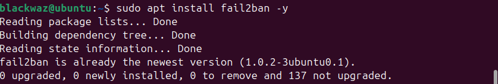
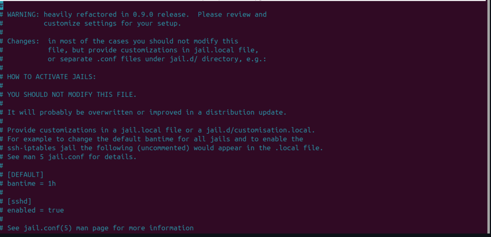
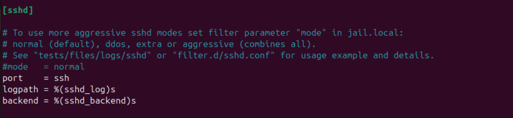
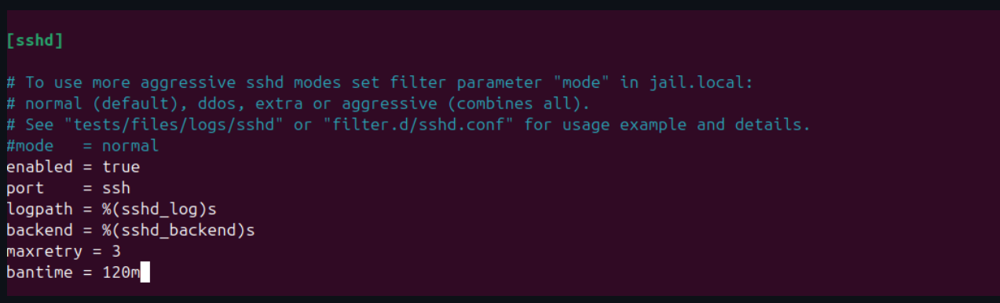

## Implementing Access Control Using AppArmor

On Ubuntu systems, AppArmor is used to implement mandatory access control by restricting how applications interact with system resources. This mechanism limits potential damage caused by compromised or misbehaving applications.

---

## AppArmor Status Verification

The current status of AppArmor can be verified using the following command:

```bash
sudo aa-status
```

This command provides information about loaded profiles, enforced profiles, and applications running under AppArmor control.



---

## Viewing AppArmor Profile Modes

AppArmor profiles can operate in different modes. These modes can be inspected using the following commands:

```bash
sudo aa-status --profiled
sudo aa-status --enforced
sudo aa-status --complaining
```

---

## Enforce Mode vs Complain Mode

AppArmor provides two primary operational modes that determine how policy violations are handled.

### Enforce Mode

In enforce mode, AppArmor actively applies security rules defined in a profile.

**Characteristics:**

1. Unauthorized actions are blocked
2. Denied operations are logged
3. Application behavior is strictly restricted
4. Full access control enforcement is provided

### Complain Mode

Complain mode does not prevent any actions but is used primarily for monitoring and profile development.

**Characteristics:**

1. Policy violations are logged without blocking execution
2. Helps identify required permissions for applications
3. Assists in refining profiles before enforcement

---

## AppArmor Profile Structure



AppArmor profiles are plain text configuration files located in `/etc/apparmor.d/`. Each profile specifies which resources an application may access. Any operation not explicitly permitted is denied by default.

---

## Key Components of an AppArmor Profile

1. **Include Files**
   Lines beginning with `#include` import common definitions and variables, such as standard directory paths.

2. **Profile Name**
   Typically defined as the absolute path to the executable being confined.

3. **Capabilities**
   Specify required Linux capabilities, such as `setgid` or `net_bind_service`, granting limited root‑level privileges.

4. **Access Permissions**

   * `r` – read access
   * `w` – write access
   * `x` – execute permission
   * `m` – memory mapping

---

## Tracking and Reporting AppArmor Activity

### Part A: Capturing the Current Configuration

To document the current AppArmor configuration and active profiles, the following command is executed:

```bash
sudo aa-status --verbose > apparmor_config_report.txt
```

The generated report can be reviewed using:

```bash
cat apparmor_config_report.txt
```

---

### Part B: Incident Reporting

AppArmor logs access violations with a "DENIED" status in system log files. These events can be extracted using:

```bash
grep 'apparmor="DENIED"' /var/log/syslog > apparmor_incident_report.txt
```

This report provides insight into blocked or restricted operations.

---

## Automatic Security Updates

Automatic system updates are configured using the `unattended-upgrades` package, ensuring timely installation of security patches.

### Installation

```bash
sudo apt install unattended-upgrades
```

### Configuration

```bash
sudo dpkg-reconfigure --priority=low unattended-upgrades
```



### Verification

The configuration can be verified by inspecting the following file:

```bash
cat /etc/apt/apt.conf.d/20auto-upgrades
```




---

## Configuration of Fail2Ban

Fail2Ban is an intrusion prevention system (IPS) that actively blocks malicious behavior by monitoring log files and applying firewall rules. Unlike intrusion detection systems (IDS), Fail2Ban automatically responds to detected threats.

### Installation

```bash
sudo apt install fail2ban -y
```



### Configuration

A local configuration file is created to override default settings:

```bash
sudo cp /etc/fail2ban/jail.conf /etc/fail2ban/jail.local
sudo nano /etc/fail2ban/jail.local
```



The `sshd` section is modified to enable protection for SSH services.

**Before configuration:**



**After configuration:**



### Verification

The service is restarted and enabled at boot:

```bash
sudo systemctl restart fail2ban
sudo systemctl enable fail2ban
```

.png)

---

## Security Baseline Script

A security baseline script is developed to verify the configurations implemented during previous phases. Each function checks a specific security control.

```bash
#!/bin/bash

# Security Baseline Check Script

check_password_auth() {
    if grep -q "^PasswordAuthentication no" /etc/ssh/sshd_config; then
        echo "[OK] PasswordAuthentication is disabled."
    else
        echo "[WARNING] PasswordAuthentication is enabled."
    fi
}

check_root_login() {
    if grep -q "^PermitRootLogin no" /etc/ssh/sshd_config; then
        echo "[OK] Root login is disabled."
    else
        echo "[WARNING] Root login is enabled."
    fi
}

check_fail2ban_status() {
    if systemctl is-active --quiet fail2ban; then
        echo "[OK] Fail2Ban is active."
    else
        echo "[WARNING] Fail2Ban is not running."
    fi
}

check_aa_status() {
    if systemctl is-active --quiet apparmor; then
        echo "[OK] AppArmor is active."
    else
        echo "[WARNING] AppArmor is not running."
    fi
}

check_autoupdates() {
    if systemctl is-active --quiet unattended-upgrades && \
       grep -q 'APT::Periodic::Update-Package-Lists "1";' /etc/apt/apt.conf.d/20auto-upgrades 2>/dev/null; then
        echo "[OK] Automatic updates are enabled."
    else
        echo "[WARNING] Automatic updates are not configured correctly."
    fi
}

print_header() {
    echo "=== SECURITY BASELINE CHECK ==="
}

main() {
    print_header
    check_password_auth
    check_root_login
    check_fail2ban_status
    check_aa_status
    check_autoupdates
}

main
```

---

## Monitoring Script

A basic monitoring script is used to remotely collect system information from the server via SSH.

### Monitoring Objectives

1. Establish a remote SSH connection
2. Display system identity and uptime
3. Monitor memory and disk usage
4. Identify high CPU‑consuming processes

### Monitoring Script

```bash
#!/bin/bash

REMOTE_USER="blackwaz"
REMOTE_HOST="192.168.56.101"

echo "----------------------------------------------------"
echo "Starting Remote Monitor for: $REMOTE_USER@$REMOTE_HOST"
echo "----------------------------------------------------"

ssh -p 22 -T $REMOTE_USER@$REMOTE_HOST << 'EOF'

    echo ">>> SYSTEM IDENTITY"
    hostname
    echo ""

    echo ">>> MEMORY USAGE (MB)"
    free -m
    echo ""

    echo ">>> DISK USAGE"
    df -h /
    echo ""

    echo ">>> TOP 5 CPU PROCESSES"
    ps aux --sort=-%cpu | head -n 6
    echo ""

EOF

echo "----------------------------------------------------"
echo "Monitoring Complete."
echo "----------------------------------------------------"
```


