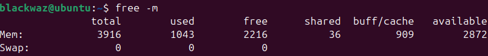
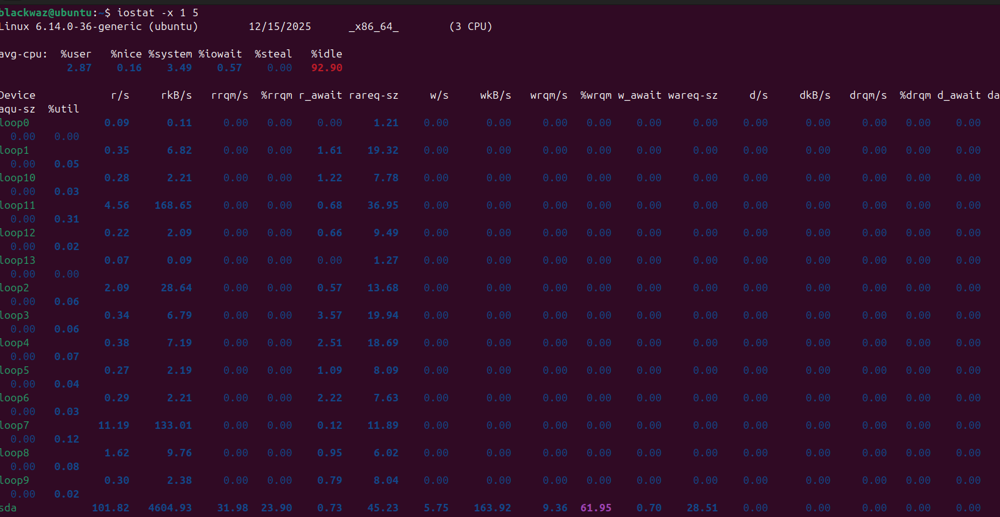
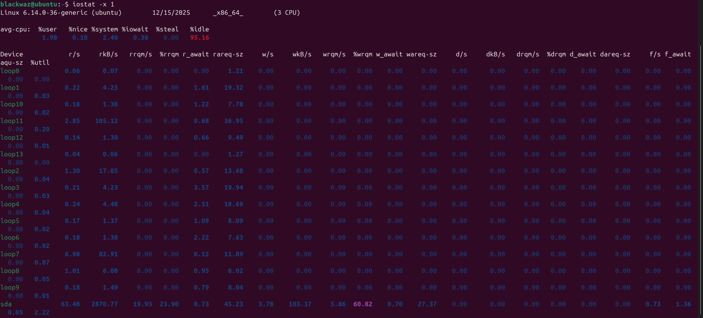
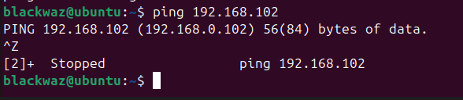

## Performance Evaluation and Analysis

---

## 1. Introduction

This document presents a structured performance evaluation of the server environment developed during the assessment phases. The analysis combines storage performance baselining and network throughput testing to establish a comprehensive system performance profile. The primary objective is to identify potential resource bottlenecks and to assess the system’s capability to handle application workloads in a stable and secure manner.

---

## Methodology: Establishing a System Baseline

A baseline is established by measuring system performance while the server is in an idle state. These baseline metrics provide a reference point for comparison during subsequent load and stress testing. The tools used for baseline monitoring include `top`, `free`, and `iostat`.

---

## Server Idle State Metrics

### CPU and Process Utilization


### Memory Availability



### Disk Subsystem (Idle State)



### Network Activity


---

## 2. Storage Subsystem Performance Analysis

To evaluate disk write performance, a direct I/O test is conducted using the `dd` utility.

```bash
dd if=/dev/zero of=testfile bs=1M count=1024 oflag=direct
```

### Performance Monitoring

Disk performance is monitored in real time using:

```bash
iostat -x 1
```



### Observations

During the write performance test, the following metrics were observed:

---

## 3. Network Subsystem Performance

### Latency Assessment

**Tool Used:** `ping` (ICMP)

Latency testing was performed to measure round‑trip time (RTT) between the client and the server.

```bash
ping -c 10 192.168.10.4
```



---

### Throughput Assessment

**Tool Used:** `iperf3`

The server and client were configured as follows:

```bash
# Server side
iperf3 -s

# Client side
iperf3 -c 192.168.10.4 -t 30
```

### Observations

* **Bandwidth:** Average throughput of 221 Mbits/sec.
* **Retransmissions:** Zero TCP retransmissions observed, indicating a stable and reliable network connection.


---

### Web Server Concurrency Testing

To evaluate application‑level performance under concurrent load, Apache Bench utilities were installed.

```bash
sudo apt install apache2 apache2-utils -y
```


### Observations

* **Throughput:** 5658.61 requests per second
* **Latency:** 17.672 ms per request
* **Transfer Rate:** 60,481.87 KB/sec (approximately 60 MB/sec)

---

## 4. Application Load Testing

### CPU and Memory Stress Testing

**Tool Used:** `stress`

```bash
# CPU Stress Test (2 cores)
stress --cpu 2 --timeout 60s

# Memory Stress Test (512 MB allocation)
stress --vm 1 --vm-bytes 512M --timeout 60s
```

---

### CPU Stress Test Results


**Observations:**

* CPU usage reached 100% on the targeted core, confirming effective CPU saturation.
* Memory usage remained stable at approximately 208 MB (~2%).

---

### Memory Stress Test Results


.png)

**Observations:**

* Memory utilization increased to 3.39 GB out of 9.96 GB.
* The system successfully handled the allocation without triggering swap usage.
* A temporary increase in CPU usage was observed due to memory allocation and deallocation operations.

---

## 5. Performance Comparison: Baseline vs Load

| Metric                   | Baseline (Idle) | Under Load  | Observation                           |
| ------------------------ | --------------- | ----------- | ------------------------------------- |
| **CPU Usage**            | 4.2%            | 100%        | Significant increase under stress     |
| **Memory Usage**         | 446 MB          | 3.39 GB     | Large allocation handled successfully |
| **Disk Throughput**      | 0 MB/s          | 188.82 MB/s | Sustained high write speed            |
| **Disk Utilization**     | 0.00%           | 90.59%      | Near device saturation                |
| **Disk Latency (await)** | 0 ms            | 4.50 ms     | Low latency maintained                |
| **Network Throughput**   | 0 Mbps          | 221 Mbps    | Stable with no packet loss            |

---

## 6. Bottleneck Identification

**Evidence:** During disk write testing, device utilization reached 90.59%, and throughput plateaued at approximately 188.82 MB/s.

**Impact:** The storage subsystem represents the primary performance bottleneck for write‑intensive workloads. Applications exceeding this throughput requirement may experience increased I/O wait times.

---

## Bottleneck Mitigation Strategies

1. **Storage Upgrade:** Replace the existing disk with an NVMe‑based SSD to significantly increase throughput.
2. **Caching Implementation:** Utilize system memory for write‑back caching to absorb temporary write spikes.
3. **I/O Separation:** Distribute operating system files and application data across separate physical disks to reduce contention.


